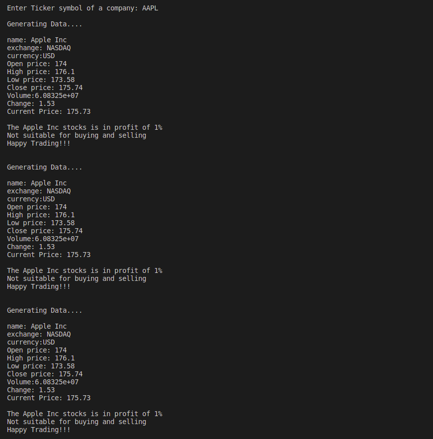

# Trading-App
This application delivers real-time data on various company stocks, empowering users to make informed buy and sell decisions. When a stock price meets the user’s specified criteria, the app triggers a buy or sell signal according to the user-defined limits. Additionally, users receive the current stock price at the time of the signal, allowing them to accurately assess costs based on live market data.

[Documentation on building Trading App in C++](https://iq.opengenus.org/trading-application-in-cpp/) in given step by step.



## Table of Contents
- [Purpose of Implementation](#Purpose-of-Implementation)
- [Project Implementation](#Project-Implementation)
   - [Project Structure](#Project-Structure)
- [Built With](#built-with)
- [Getting Started](#getting-started)
  - [Prerequisites](#prerequisites)
- [Authors](#authors)
- [Show Your Support](#show-your-support)

## Purpose of Implementation
# Trading App

The **Trading App** is designed to provide users with a powerful tool for making real-time stock trading decisions. With this application, users can stay informed about stock prices, receive actionable signals, and assess trade costs efficiently.

## Key Features

- **Real-time Data Monitoring**: Tracks stock prices continuously, providing users with the latest market information to support timely decisions.

- **Signal Generation**: Sends buy or sell signals based on user-defined criteria, helping users act when specific conditions are met.

- **Cost Calculation**: Calculates stock costs at the moment signals are generated, enabling users to quickly evaluate potential profit or loss.

---

This app empowers users to make informed trading decisions based on live market data and tailored alerts.

## Project Implementation

This section provides an overview of the implementation of the trading application and how the source code is organized.

### Project Structure

# Trading App Project Structure

The **Trading App** is organized into multiple files, each dedicated to specific functionalities that support real-time stock trading. Here’s an overview of the project's structure:

## Project Files

- **`curl_functions.hpp` and `curl_functions.cpp`**  
  These files contain functions for making HTTP requests to fetch stock data from an external API. Key functions include:
  - `get_price(const string& ticker_symbol, const string& api)`: Fetches the current price of a specified stock.
  - `get_stock_quote(const string& ticker_symbol, const string& api)`: Retrieves detailed stock information for a specified ticker.

- **`functions.hpp` and `functions.cpp`**  
  These files define functions essential to the app's trading logic:
  - `ProfitLoss(float open, float close, string name)`: Calculates and displays the profit or loss percentage for a stock.
  - `wantTransact(string ans, int amount, float price)`: Manages user input for buying or selling stock and calculates transaction costs.
  - `print_data(string name, string exchange, string currency, float open, float high, float low, float close, float volume, float change, float price)`: Displays comprehensive stock information for the user.
  - `Sendsignal(float price, float high, float low, string ans, int amount)`: Evaluates stock price against user-defined criteria to determine whether to send a buy or sell signal.

---

Each file contributes to the adjustable and flexiblity of the Trading App, enabling effective real-time data retrieval, trading logic, and user interaction.


- **`main.cpp`:** The main entry point of the application are user interactions and the base logic of the program that are implemented.
 This file:
  - Prompts the user for a ticker symbol.
  - Reads the API key from the `config.json` file.
  - Makes use of functions from other files to fetch stock data and perform trading-related tasks.
  - Can be customized to add additional trading strategies and features.

- **`config.json`:** This JSON configuration file stores sensitive information, such as the API key required to access external data sources. It's necessary for maintainance of the security and allows for easy configuration without changing the code.


## Built With

This application is primarily built using C++ STL (Standard Template Library).

## Getting Started

To get started with the Trading App, follow these steps:

1. Download or clone this repository using the following command:
   ```
   git clone https://github.com/OpenGenus/trading-app-in-cpp.git
   ```

2. Navigate to the project folder.

3. Compile the application using Visual Studio Code with the following command:
   ```
   g++ -o "output/output file name" main.cpp curl_functions.cpp functions.cpp -lcurl -ljsoncpp
   ```

4. Run the compiled application using the following command:
   ```
   ./output/output file
   ```
5. **Shortcut for running and compiling:**
Alternatively, you can use the shortcut script to simplify the compiling and running process.

Run: ``` ./compile-and-run.sh  ```

### Prerequisites

Before running the Trading App, make sure you have the following prerequisites installed:

- **curl library:** Install the curl library for making HTTP requests.

- **JsonCpp library:** Install the JsonCpp library for JSON parsing and manipulation in C++.

- **API Key:** Sign up at Twelve Data to obtain your own API key. Place your API key in the `config.json` file.
